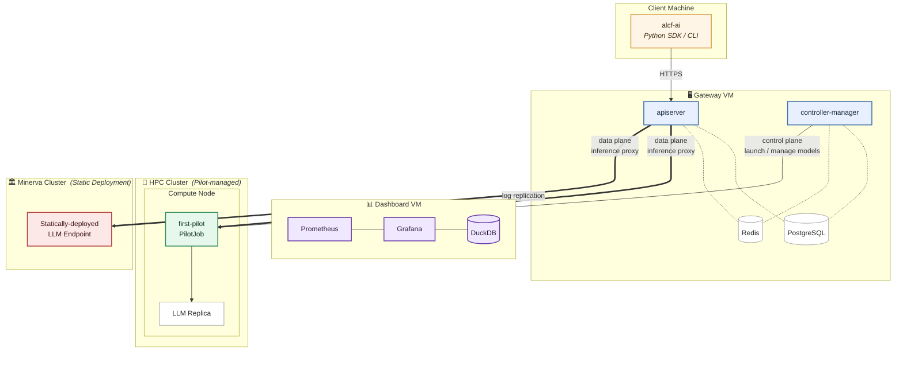

```mermaid
  flowchart TB
      classDef user fill:#fff5e6,stroke:#d49a3a,stroke-width:2px,color:#3a2a10
      classDef gw fill:#e8f0ff,stroke:#3b6ea8,stroke-width:2px,color:#1a2a3a
      classDef dash fill:#f0e8ff,stroke:#6a3ba8,stroke-width:2px,color:#2a1a3a
      classDef pilot fill:#e6f7ec,stroke:#2e8b57,stroke-width:2px,color:#10331f
      classDef static fill:#fde8e8,stroke:#b03a3a,stroke-width:2px,color:#3a1010
      classDef store fill:#ffffff,stroke:#888,stroke-width:1px,color:#222

      subgraph Laptop["Client Machine"]
          CLI["alcf-ai<br/><i>Python SDK / CLI</i>"]:::user
      end

      subgraph GVM["🖥️  Gateway VM"]
          direction TB
          API["apiserver"]:::gw
          CM["controller-manager"]:::gw
          PG[("PostgreSQL")]:::store
          RD[("Redis")]:::store
          API -.- PG
          API -.- RD
          CM -.- PG
          CM -.- RD
      end

      subgraph Clusters[" "]
          direction LR
          subgraph HPC["🧮 HPC Cluster &nbsp;<i>(Pilot-managed)</i>"]
              direction TB
              subgraph Node["Compute Node"]
                  direction LR
                  PJ["first-pilot<br/>PilotJob"]:::pilot
                  MDL["LLM Replica"]:::store
                  PJ --> MDL
              end
          end
          subgraph MIN["🏛️  Minerva Cluster &nbsp;<i>(Static Deployment)</i>"]
              STATIC["Statically-deployed<br/>LLM Endpoint"]:::static
          end
      end

      subgraph DVM["📊 Dashboard VM"]
          direction LR
          PROM["Prometheus"]:::dash
          GRAF["Grafana"]:::dash
          DUCK[("DuckDB")]:::dash
          PROM --- GRAF --- DUCK
      end

      CLI -->|"HTTPS"| API

      CM -->|"control plane<br/>launch / manage models"| PJ
      API ==>|"data plane<br/>inference proxy"| PJ
      API ==>|"data plane<br/>inference proxy"| STATIC

      GVM -.->|"log replication"| DVM

      style Clusters fill:none,stroke:none
```
