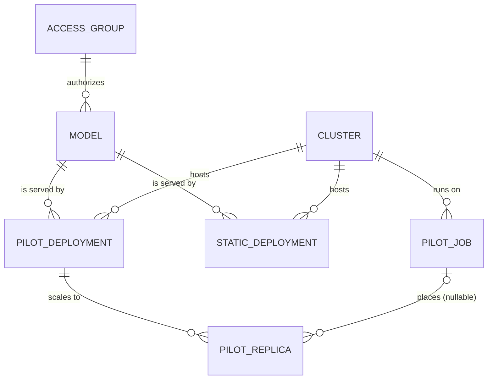

# Data Model

The Postgres schema is the source of truth for the desired and current
state of every model and deployment, across all clusters. Each table is
designed to be owned by a specific controller; see the
[Controller Framework](controllers.md) for how rows are meant to be
acted on (most controllers are still under construction — today the
schema is fully defined and exercised by the plan/apply path, and the
controller framework itself is in place, but only a stub controller is
wired up).

The authoritative class definitions live in
`first_gateway.database.models` (SQLAlchemy ORM, schema `first`) and
their declarative Spec counterparts in
`first_common.schema.resources.spec`.

## Storage layout: one table per resource

The Spec/Status split (see [Declarative Configuration](declarative-config.md))
is an *API-shape* distinction, not a storage one. Each resource is a
**single Postgres table** (a `ResourceRow` SQLAlchemy subclass) whose
columns are the union of its Spec and Status fields.

- Embedded value objects that are not independently addressable —
  `PilotLaunchSpec`, `RouterParams`, the various `Status` blobs — are
  stored as **JSONB columns**.
- Genuinely high-churn, ephemeral state stays **out of Postgres
  entirely**: live in-flight request counts and load averages live in
  Redis, not in a column we would otherwise hammer with writes.

## Naming convention

Every `ResourceRow` table has both:

- A `uid` **integer primary key** (surrogate, `BigInteger`).
- A **string `name`** column with a unique constraint, validated as
  `ResourceName` (2–128 chars).

The string `name` is what YAML manifests reference, so admins don't have
to manage numeric IDs by hand. Keeping the PK separate from the name
also means that a resource which was deleted and re-created under the
same name is distinguishable from the original by its `uid` — useful
when interpreting old audit log entries.

Foreign keys point at the parent's **`name`** rather than its `uid`, so
declarative manifests can be applied with admin-readable references
only.

## Resources at a glance

### `AccessGroup` — admin Spec

Globus groups + email domains used for authorization. Other resources
point at an `AccessGroup` to delegate "who can use this."

Fields: `allowed_groups: list[str]`, `allowed_domains: list[str]`.

### `Model` — admin Spec

A routable, public model name and the OpenAI/Anthropic-style endpoints
it can be invoked through.

- FK → `AccessGroup` (`access_group_name`).
- `supported_endpoints: list[str]` (e.g. `chat/completions`,
  `embeddings`).

### `Cluster` — admin Spec

A physical grouping for deployments — a single HPC site or a logical
group of nodes — with shared status and (optionally) a `pilot_system`
configuration.

- `status_method` (an `ImportString` pointing at a callable like
  `first_gateway.platforms.health.get_alcf_cluster_status`) +
  `status_kwargs`. A controller dispatches by name to refresh
  `status` / `last_status_check`.
- `pilot_system: PilotConfig | None` — if set, the cluster supports
  pilot-job submissions. The `PilotConfig` carries the scheduler
  adapter import path, queue/account, workdir, NGINX path, pilot
  version pin, etc.

### `PilotDeployment` — admin Spec, controller Status

An HPC-managed deployment of a model, hosted via the
[pilot job system](pilot-system.md).

- FK → `Model`, FK → `Cluster`.
- `launch_spec: PilotLaunchSpec` — the Jinja template + GPU/node sizing
  + env that the pilot uses to start each replica subprocess. The
  template is validated at apply time against
  `SCRIPT_TEMPLATE_VARIABLES`.
- `router_params`, `health_check_method`, `prometheus_metrics_path` —
  how the deployment integrates with the router + observability.
- Autoscaler controls: `scaling_strategy: LoadThresholdStrategy | None`,
  `min_replicas`, `max_replicas`.
- Controller-owned Status: `desired_replicas`, `health`,
  `last_health_check`, `consecutive_launch_failures`.

### `StaticDeployment` — admin Spec, controller Status

A model deployment that is managed *externally* (already-running
endpoint), not by the pilot system. FIRST just proxies to it.

- FK → `Model`, FK → `Cluster`.
- `api_url`, `upstream_model_name`, optional `api_key: SecretRef`
  (`env_var://NAME` resolved JIT, so manifests can be applied without
  the secret material on the local machine).
- Status: `health`, `last_health_check`.

### `PilotJob` — controller-managed

A submitted scheduler job that brought up a `first_pilot` process on the
cluster. A pilot job is a **GPU pool**, not a model container — one
pilot can host replicas of several different `PilotDeployment`s on the
same node, so the FK to `Cluster` is intentionally singular and no FK
to `PilotDeployment` exists.

Notable fields: `scheduler_job_id`, `phase: JobPhase`, `manager_url`
(set once the pilot's readyfile is discovered), `manager_health`,
`resources: PilotResources` (mirrored from the pilot's `/status`),
`idle_since` (drives idle-pilot reaping), `walltime_min`,
`num_nodes`, `gpus_per_node`.

There is **no** `PilotJobSpec`; pilot jobs are not declarative — they
are created and destroyed by controllers in response to
`PilotDeployment` demand.

### `PilotReplica` — controller-managed

A single running replica of a model inside a pilot job.

- FK → `PilotDeployment` (the recipe for starting this model).
- **Nullable** FK → `PilotJob` (which job, if any, the replica has been
  placed on). The nullable FK is what lets the placement controller
  create replicas in a "pending placement" state and bind them to a job
  as capacity opens up.
- `used_resources: list[GpuClaim]`, `model_url`, `observed_served_name`,
  `phase: ReplicaPhase`, `status_info`, `last_health_check`,
  `started_at`.

### `ConfigVersion` — non-resource, audit-only

One row per successful `apply`, with the previous version's `uid + 1`
as PK (used for optimistic concurrency, see
[Declarative Configuration](declarative-config.md)). Records
`applied_by` and a JSONB `changes` snapshot for audit.

## How the relationships drive controllers

- The placement controller watches `PilotReplica.pilot_job_id IS NULL`
  rows and binds them to suitable `PilotJob`s.
- The pilot autoscaling controller compares `PilotDeployment.desired_replicas`
  to live `PilotReplica` counts to decide whether to submit more
  `PilotJob`s.
- The router config controller rolls up the `(Model, PilotDeployment,
  PilotReplica)` triple into the Redis-cached router map the data plane
  reads from.
