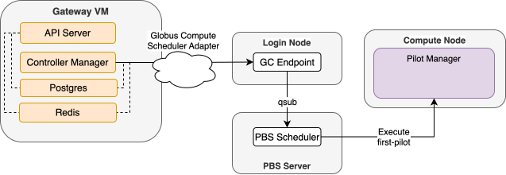
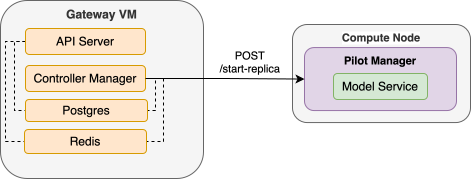
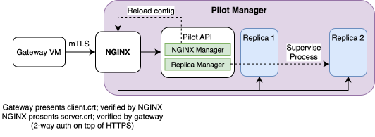

# Pilot Job System

The pilot system is how FIRST extends the control plane onto HPC compute
nodes. One pilot is one scheduler job; once a pilot is running, the
gateway can place, stop, and observe model replicas inside it on demand.

This page walks through the pilot lifecycle in three pieces:

1. **Submission** — how a pilot job gets onto the cluster.
2. **Communication** — how the gateway talks to a running pilot.
3. **On-node architecture** — what runs inside the allocation.

See also the [`first_pilot` package reference](../packages/pilot.md) for
config field details, ports, and CLI entry points.

## 1. Submission via SchedulerAdapter

The gateway's pilot system takes a **pluggable `SchedulerAdapter`** (the
ABC in `first_common.schema.base_scheduler:SchedulerAdapter`) so the
same controllers can drive different HPC facilities. The adapter
surface is small — `submit_job`, `get_job_statuses`, `terminate_job`,
plus `put_file`/`list_files`/`read_file` for staging the pilot's config
+ submit script onto the cluster filesystem.

`PilotSubmitter` (in `first_gateway.services.pilot_submitter`) is the
layer above the adapter. Per pilot-job submission it:

1. Builds per-job `PILOT_*` environment overrides (job name, port,
   allowlist, workdir, node/GPU counts, `PILOT_WALLTIME_MIN`) on top of the
   cluster's pre-staged `PilotRuntimeConfig` at
   `PilotConfig.pilot_config_path`, which holds the CA and the `first-pilot`
   server certificate. The gateway does not issue certificates.
2. Builds a small shell script that execs the pinned `first-pilot`
   (`PilotConfig.pilot_path`) with `PILOT_CONFIG_FILE` pointing at that YAML.
   GraphQL-PBS takes the script inline; Globus Compute needs it staged
   via `adapter.put_file`.
3. Calls `adapter.submit_job` with the resulting `JobSubmitPayload`,
   under a prefixed name so zombie discovery can
   distinguish FIRST-owned jobs from anything else on the queue.

### Adapters shipped today

| Adapter | Status |
|---|---|
| `GlobusComputePBSAdapter` (`platforms/schedulers/globus_compute_pbs.py`) | Implemented. Just-in-time registers `_qsub`/`_qstat`/`_qdel`/`_put_file`/`_list_files`/`_read_file` as Globus Compute functions at `build()` time and dispatches each adapter call via Globus Compute. Polls for results with a `TaskPending`/asyncio sleep loop (to sidestep AMQP issues). |
| IRI / Direct PBS / others | Future adapters; the abstraction is in place. |

The adapter's only job is to **get the pilot job submitted and report
back its scheduler id**. It is *not* on the runtime path.

## 2. After the job starts: direct control-plane connection

Once the scheduler dispatches the pilot job, the `SchedulerAdapter` steps
out of the picture. The gateway and the running pilot communicate
**directly** over mTLS — no scheduler-side hop, no Globus Compute task on
the hot path.

This matters for two reasons:

- **Latency.** Replica start/stop calls are sub-second round trips, not
  scheduler-mediated tasks.
- **Blast radius.** Adapter outages do not affect already-running pilots
  — they only prevent *new* pilots from being launched.  A pilot may run for
  40 days and serve many changing model replicas over its lifespan, without
  having to involve the login node.

## 3. On-node architecture

Inside the allocation, the pilot brings up two cooperating subsystems
behind a single NGINX terminator.

### NGINX terminator

- The pilot API starts NGINX first and puts itself behind it.
- **One** external port is opened per compute node; everything else is
  loopback.
- The port is secured by **mTLS** plus an IP allow-list. NGINX requires a
  client cert signed by the environment's CA, then **authorizes by subject**:
  it maps `$ssl_client_s_dn` to a role and denies by default (see
  [Authorization](#authorization)).
- The NGINX manager re-renders the NGINX config and `SIGHUP`-reloads
  **gracefully** as replicas come and go — in-flight traffic is not
  dropped.

### Authorization

Each gateway service holds exactly one client identity, and the pilot
checks every request's normalized path against that identity's role:

| Client CN | Holder | Permitted |
|---|---|---|
| `first-control` | `controller-manager` | All paths |
| `first-router` | `inference-gateway` (API server) | `/replicas/…` (inference); `GET /control/logs/…` |
| `first-metrics` | `prometheus` | `GET /replicas/…/metrics` only |
| anything else | — | Nothing (403) |

Because the metrics role is limited to that path, pilot deployments must
serve Prometheus metrics at `/metrics`.

The pilot presents `CN=first-pilot` (serverAuth). Clients verify the CA
chain but not the hostname: compute nodes have no DNS names and the node
is picked by the scheduler after the certificate is issued. See the
[F-01 response](../security/control-plane-mtls-response.md) for the threat
model and the [Certificate Manager](../packages/certmanager.md) for issuing.

### Control APIs

The pilot exposes a small FastAPI control plane reachable at
`https://<job-ip>:<external_port>/control/`. Internally it binds to
`127.0.0.1:<external_port + 1>` so NGINX is the only externally-reachable
listener; replicas live on `external_port + 2`, `+3`, … and are reverse-
proxied at `/replicas/{name}/`.

| Endpoint | Purpose |
|---|---|
| `POST /start-replica` | Body `ReplicaStartRequest` — place a replica with the given `ResolvedLaunchSpec` and `GpuClaim`s; fails fast on local conflict |
| `POST /stop-replica/{name}` | Terminate the replica subprocess, free its GPUs, drop its NGINX route |
| `GET /status` | `PilotJobStatus` — replica list + node/GPU inventory |
| `GET /logs/{name}` | On-demand tail (~200 lines) of `stdout`/`stderr`/user log |

### Replica manager

The replica manager renders each model's startup script and supervises
the resulting subprocess plus a daemon health monitor thread:

- **Health-driven termination.** Replicas that take too long to start, or
  that become unhealthy, are killed locally.
- **Self-healing deployments.** Once a replica is killed, the gateway's
  replica controller garbage-collects the dead row and spawns a fresh
  one — the desired-replica-count gets re-met without admin action.
- **Backoff on bad specs.** Consecutive startup failures are tracked per
  deployment; after enough in a row, the controller stops hammering the
  scheduler with a doomed spec.

## Why this shape

A few non-obvious design choices fall out of this architecture:

- **Pilots are GPU pools, not model containers.** One pilot can host
  replicas of multiple different model deployments on the same node —
  the pilot owns the allocation, the *replica* is what binds to a
  specific model recipe.
- **The gateway never reaches a replica directly.** Every request hits
  NGINX first, which authenticates and authorizes the client cert and
  proxies to the right local port.
- **Certs are issued offline.** No gateway process holds a CA key. An
  admin issues one server cert per environment and one client cert per
  gateway role with the [certificate manager](../packages/certmanager.md)
  and stages them ahead of time. A pilot refuses to start if its server
  cert would expire within the job's walltime.
