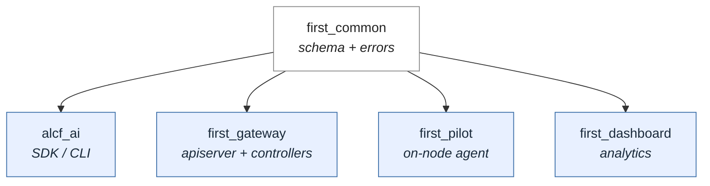

# Project Layout

The repository is a single [uv workspace](https://docs.astral.sh/uv/concepts/projects/workspaces/)
that ships **five independently-distributed packages**. The split is by
*where each package runs*, so users can install only what they need —
e.g. the client toolkit pulls none of the server-side dependencies.

| Package | Installed on | Purpose |
|---|---|---|
| `alcf_ai` | end-user laptops | Python SDK and CLI for the inference API |
| `first_common` | everywhere | Shared schema (resource Specs, scheduler ABC, pilot wire types, structured logs) and error hierarchy |
| `first_gateway` | Gateway VM | API server + controller manager |
| `first_pilot` | HPC compute nodes | Per-job agent that hosts model replicas |
| `first_dashboard` | analytics server | Log aggregation, queries, dashboards (skeleton only today) |

## Why split this way

- **Independent release cadence.** The client SDK is published frequently;
  the pilot agent updates only when the on-node protocol changes.
- **Minimal install footprint per role.** A user running `uvx alcf-ai chat`
  doesn't pay for SQLAlchemy, FastAPI, or any HPC adapter dependencies.
- **One git repo, one set of CI hooks.** Type-checking, formatting, and
  testing run over the whole workspace from a single root `Makefile`
  (`make mypy`, `make format`, `make lint`, `make test`).

See the [Developer Guide](../getting-started/developer.md) for the local
dev workflow over the workspace.
