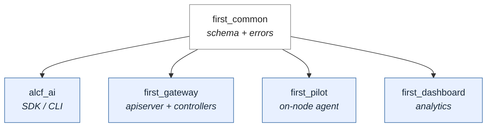

# Project Layout

The repository is a single [uv workspace](https://docs.astral.sh/uv/concepts/projects/workspaces/)
that ships **five independently-distributed packages**. The split is by
*where each package runs*, so users can install only what they need —
e.g. the client toolkit pulls none of the server-side dependencies.



```mermaid
flowchart TB
    classDef shared fill:#fff,stroke:#888,color:#222
    classDef leaf fill:#e8f0ff,stroke:#3b6ea8,color:#1a2a3a

    COMMON["first_common<br/><i>schema + errors</i>"]:::shared

    CLIENT["alcf_ai<br/><i>SDK / CLI</i>"]:::leaf
    GW["first_gateway<br/><i>apiserver + controllers</i>"]:::leaf
    PILOT["first_pilot<br/><i>on-node agent</i>"]:::leaf
    DASH["first_dashboard<br/><i>analytics</i>"]:::leaf

    COMMON --> CLIENT
    COMMON --> GW
    COMMON --> PILOT
    COMMON --> DASH
```

| Package | Installed on | Purpose |
|---|---|---|
| `alcf_ai` | end-user laptops | Python SDK and CLI for the inference API |
| `first_common` | everywhere | Shared schema (resource Specs, scheduler ABC, pilot wire types, structured logs) and error hierarchy |
| `first_gateway` | Gateway VM | API server + controller manager |
| `first_pilot` | HPC compute nodes | Per-job agent that hosts model replicas |
| `first_dashboard` | analytics server | Log aggregation, queries, dashboards (skeleton only today) |

## Why split this way

- **Independent release cadence.** The client SDK is published frequently;
  the pilot agent updates only when the on-node protocol changes.
- **Minimal install footprint per role.** A user running `uvx alcf-ai chat`
  doesn't pay for SQLAlchemy, FastAPI, or any HPC adapter dependencies.
- **One git repo, one set of CI hooks.** Type-checking, formatting, and
  testing run over the whole workspace from a single root `Makefile`
  (`make mypy`, `make format`, `make lint`, `make test`).

See the [Developer Guide](../getting-started/developer.md) for the local
dev workflow over the workspace.

## Detailed Package Layout

**Gateway (first_gateway) Layout:**

```
├── apiserver:         FastAPI Application (Auth, Depends, ...)
│   └── routes         API Routes
├── controllers        Control Plane Manager + Framework
│   └── workers        Control Plane Workers (loops managed under Manager)
├── database           Postgres (SQLAlchemy ORM) + Redis (custom classes)
│   ├── migrations     (Alembic SQL Migrations)
│   │   └── versions
│   └── redis          (Admission Controller, Key Builder, RedisRepo)
│       └── lua        (Lua scripts for Admission Controller)
├── platforms          (Platform-specific: extend here to support new HPC clusters)
│   └── schedulers     (Platform-specific SchedulerAdapters)
└── services           (Any significant chunk of logic factored out of the FastAPI app)
    └── certmanager    (Generator of mTLS certificates)
    pilot_control.py   (mTLS httpx Client)
    pilot_submitter.py (uses SchedulerAdapter to launch PilotJobs)
    plan_apply.py      (The declarative YAML config apply logic)

log_config.py          Central logging configuration
settings.py            Central Settings class (load from environment)
                       & ClientState (shared state class for FastAPI and Controllers)
```

**Common (first_common) Layout:**
```
├── errors.py                    All FirstError Classes
├── health.py                    Generic HTTP Health Check Method
└── schema                       Common Pydantic models and shared interfaces
    ├── auth.py                  Auth-related models
    ├── base_scheduler.py        ABC for SchedulerAdapter (referenced in Pydantic models)
    ├── pilot.py                 Pydantic Models for Gateway<-->Pilot Interaction
    ├── resources                Models for the Database Resources
    │   ├── __init__.py
    │   ├── config_version.py    Audit Tracker (History of Config Changes)
    │   ├── plan_apply.py        Generic Schemas for the Admin Plan/Apply Tool
    │   ├── read.py              Schemas for FastAPI responses
    │   ├── runtime.py           Schemas for RedisRepo-sourced data (fast changing; ephemeral)
    │   └── spec.py              Schemas for each resource's declarative configuration
    ├── structured_logs.py       Schemas for JSONL log events
    └── types.py                 Common types referenced by the schemas
```

**Pilot (first_pilot) Layout:**
```
├── control_api.py        Pilot Job Entrypoint and FastAPI
├── nginx_manager.py      NGINX launcher/reloader
├── replica_manager.py    Free GPU tracker / Replica assigner
└── replica.py            Replica class: manage subprocess and health check loop
```

**Client (alcf-ai package) Layout:**

```
├── __init__.py
├── _http.py      Response utils
├── api/          Classes grouping related API functions on the InferenceClient (by functional area)
├── auth.py       Globus Auth (access/refresh tokens) Helper
├── cli.py        Typer CLI entrypoint
├── client.py     InferenceClient class (programmatic access to all Inference Service)
├── resources     More classes grouping related API functions on the Inference Client (by resource type)
├── subcommands   Nested Typer CLI Subcommands
└── transfer.py   Globus Transfer Helper
```