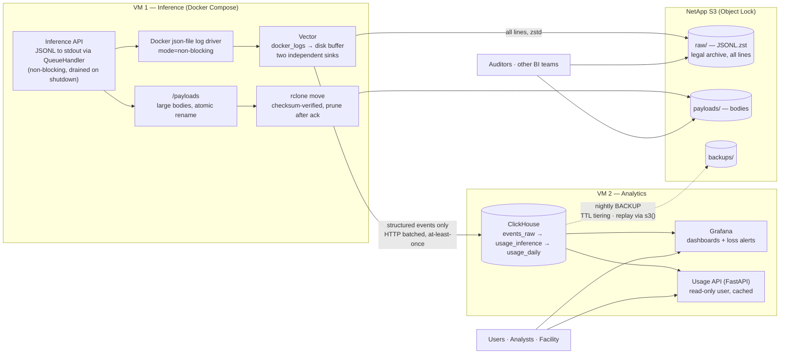

# Usage Logging & Analytics Pipeline — Design

**Status:** Proposed · **Date:** 2026-09-09

The inference gateway emits structured JSONL usage events on the data plane. A
collector ships them to a ClickHouse OLAP store on a separate VM, where Grafana
dashboards and a small usage API serve analytics, cost tracking, and (later)
project allocation. This document records the architecture and the design
decisions behind it so future work builds on the same reasoning.

## Goals

- Retain every usage record (tokens per request, per model, per user).
- Retain **every request and response body** in full (including streamed
  responses), and **every raw log line** for auditors and other BI teams, in
  on-prem S3-compatible object storage (NetApp).
- Add **zero backpressure** to the inference hot path.
- Serve three query classes: per-user usage (hot, latency-sensitive), analyst
  trend/BI queries, and facility-level allocation tracking.
- Eventual consistency is acceptable; **silent loss is not** — losses must be
  measurable and alarmed.

## Non-goals (for now)

- Synchronous quota *enforcement* on the request path. The pipeline is
  at-most-once until bytes reach disk; enforcement needs an outbox or dual-write
  to Postgres (see [Future work](#future-work)).
- High availability of the analytics tier. Single-node ClickHouse plus backups
  is sufficient for a usage log.

## Architecture



Every hop is asynchronous and buffered, so the inference process never waits on
anything downstream. Backpressure is absorbed, in order, by the app's log queue,
the Docker driver's ring buffer, and Vector's per-sink disk buffers. Bodies take
a separate path (local disk → rclone → S3) that never touches the log pipeline.

### VM 1 — Inference

**Application.** Structured events are emitted through the logging
`QueueHandler`; large bodies are off-lined to disk on a worker thread. The queue
is bounded and drop-on-overflow (with a `dropped_events` counter) rather than
blocking. `drain_logs()` flushes the listener on graceful shutdown (ASGI
lifespan `finally`, plus `atexit`), removing the most common loss cause: rolling
restarts.

**Docker log driver.** stdout is itself a backpressure source: if the runtime's
pipe fills, `write()` blocks. Configure the service with
`logging: {driver: json-file, options: {mode: non-blocking, max-buffer-size: 32m, max-size: 100m, max-file: "5"}}`.
Under sustained downstream failure the ring buffer drops lines instead of
stalling inference — consistent with the lossy-but-loud posture.

**Vector** runs as a Compose service on the same VM with `/var/run/docker.sock`
mounted. One source fans out to two sinks with independent disk buffers, so a
ClickHouse outage never stalls the archive and vice versa.

```
docker_logs ──┬─▶ [remap: parse_json, keep only event_id lines] ──▶ clickhouse sink
              └─▶ (unfiltered) ─────────────────────────────────▶ aws_s3 sink (raw archive)
```

| Component | Config |
|---|---|
| Source | `docker_logs`, `include_containers: [inference-api]` |
| Transform (CH branch only) | `remap`: `parse_json!(.message)`; drop lines without `event_id` (debug logs go to the archive, not ClickHouse) |
| Buffers (each sink) | `buffer: {type: disk, max_size: 4GiB, when_full: block}` — Vector blocks *its own* intake, never the app |
| ClickHouse sink | `endpoint: https://vm2:8443`, `table: events_raw`, `batch: {max_bytes: 10MiB, timeout_secs: 5}`, `request.retry_attempts: unlimited`, `skip_unknown_fields: true` |
| S3 archive sink | see [Raw log archive](#raw-log-archive-legal-retention) |

Vector uses a dedicated ClickHouse user with `INSERT` on `events_raw` only, and
an S3 credential with `PutObject` only on `raw/`. Port 8443 on VM 2 is reachable
only from VM 1's private address.

**Body storage.** See [Request/response bodies](#requestresponse-bodies).
Bodies never pass through the log pipeline; the log row carries a reference.

## Request/response bodies

Requirement: every request and response body, including fully assembled
streamed responses, is retained in its entirety. Bodies can be large (base64
images, long agentic traces), so they are not embedded in log events.

**Write path (in the app, off the hot path).**

1. Bodies ≤ 2 KB are stored inline on the event (`body` field). Larger bodies
   are written by the logging worker thread to local disk, never by the request
   handler.
2. Write to `/payloads/tmp/{event_id}`, `fsync`, then atomically `rename()` to
   `/payloads/{kind}/YYYY/MM/DD/{event_id}.log` where `kind ∈ {requests,
   responses}`. Streamed responses are accumulated and written once complete;
   the rename is the "file is finished" signal. The uploader never sees a
   partial file.
3. The event carries the reference and an integrity fingerprint:
   `body_ref` (S3 key), `body_bytes`, `body_sha256`. Auditors can verify an
   object against the log row.

**Upload path (rclone sidecar).** Vector is a log pipeline, not a file mover —
its `file` source would split a body into line-events and lose the key. rclone
does exactly one thing well here:

```
rclone move /payloads netapp:inference-payloads/payloads \
  --min-age 30s --checksum --transfers 8 --exclude "tmp/**" \
  --delete-empty-src-dirs --retries 10 --low-level-retries 20
```

Run as a Compose service on a loop (`while true; do rclone move …; sleep 30; done`)
or a systemd timer. rclone verifies the checksum/ETag after each PUT and deletes
the local file only on a successful match. `--min-age` plus the `tmp/` exclusion
is belt-and-braces against half-written files. Local disk for `/payloads` should
be sized for the longest tolerable S3 outage (e.g., 48 h of peak body volume);
alert on directory size and on rclone's failure exit codes.

**Bucket policy.** Object Lock (compliance mode) with a retention period matching
the legal requirement, versioning on, and no delete permission on the rclone
credential. Nothing on the VM can shorten retention.

**Simplification to consider.** Drop the 2 KB inline split and write *every*
body to a file. One code path, one storage location, one integrity story; small
objects are cheap. Keep the split only if inline bodies are needed in ClickHouse
queries (e.g., error responses for triage).

## Raw log archive (legal retention)

Requirement: full raw logs retained for auditors and other BI teams to analyze
with their own tools. This is a second Vector sink on the **unfiltered** stream —
every stdout line, structured or not.

```yaml
sinks:
  s3_raw_archive:
    type: aws_s3
    inputs: [docker_logs]            # unfiltered; the CH branch is filtered separately
    endpoint: https://netapp-s3.internal
    bucket: inference-logs
    key_prefix: "raw/year=%Y/month=%m/day=%d/"
    filename_time_format: "%H%M%S"
    filename_append_uuid: true
    filename_extension: json.zst
    encoding: { codec: json }
    compression: zstd
    batch: { max_bytes: 256MiB, timeout_secs: 300 }
    buffer: { type: disk, max_size: 8GiB, when_full: block }
    request: { retry_attempts: unlimited }
```

Properties:

- **System of record.** This archive, not ClickHouse, is authoritative for "what
  was logged." Object Lock applies here too.
- **Replay source.** ClickHouse can re-ingest directly:
  `INSERT INTO events_raw SELECT … FROM s3('…/raw/**/*.json.zst', 'JSONEachRow')`.
  This makes the `raw String` column on `events_raw` redundant; TTL it after 30
  days or drop it.
- **Sized for humans.** Large batches yield hundreds of objects per day, not
  millions; the Hive-style `year=/month=/day=` prefix lets DuckDB, Spark, Trino,
  and ClickHouse's `s3()` prune by date.
- **Parquet is deferred.** JSONL.zst satisfies the retention requirement. If a
  BI team needs columnar files, export curated monthly Parquet from ClickHouse
  (`INSERT INTO FUNCTION s3(…, 'Parquet') SELECT … FROM usage_inference`) rather
  than having Vector encode the pre-dedup stream with an inferred schema.

### VM 2 — Analytics

- **ClickHouse** — official `clickhouse/clickhouse-server` image, Apache 2.0,
  single node, data on a persistent volume. Nightly `BACKUP DATABASE … TO S3(…)`.
  `async_insert=1` on the Vector user so many small batches coalesce
  server-side.
- **Grafana** — official ClickHouse data source plugin. Hosts the usage
  dashboards and the loss-detection alert.
- **Usage API** — FastAPI service with one shared `clickhouse-connect` client,
  a `readonly=1` ClickHouse user with `max_execution_time=5`, capped
  `max_threads=2` and `max_memory_usage`, and a 60 s per-user result cache. Serves
  "what is my usage?" from the daily rollup, not raw rows.

## Event model: emit at source, join downstream

Three lean events are emitted where each becomes known, correlated by a shared
`request_id`:

| Event | Emitted in | Carries |
|---|---|---|
| `RequestLog` | auth dependency, post-auth | user/auth context, method, path, origin IP |
| `ResponseLog` | ASGI middleware, after send | status, duration, streaming flag |
| `InferenceLog` | `InferenceService`, **once per backend attempt** | backend/deployment/cluster, `outcome`, `attempt`, token usage, `user_id` (denormalized) |

We chose this over one combined end-of-request event because:

1. **Failures are the high-value rows.** Upstream 5xx, timeouts, and mid-stream
   disconnects are exactly where a single end-of-request emit never runs.
   `RequestLog` is already durable before the failure.
2. **Write grain ≠ read grain.** A request fans out (retries today,
   disaggregated prefill/decode soon). N `InferenceLog`s per `request_id` capture
   consumption on every attempt; the single-request view is a rollup.
3. **Loss is only detectable if streams are mutually redundant.** A lost
   combined event leaves no trace. With three streams, a missing `InferenceLog`
   for a successful response is a countable, alarmable "dropped usage row."

The denormalized single-row view is still produced — in ClickHouse, where it
costs nothing on the hot path.

### Two identities

**Deduplicate on the identity of the write; correlate on the identity of the
request.** These must never be the same column.

| Key | Uniqueness | Purpose |
|---|---|---|
| `request_id` | Shared across the 3 streams and across retry attempts | Roll up all events of one request |
| `event_id` (UUIDv4 at emit) | Unique per emitted event | Collapse Vector's at-least-once redelivery |

Deduping on `request_id` would fold all three streams and every retry into one
surviving row.

## ClickHouse schema

MergeTree has one physical structure: the sorting key (`ORDER BY`). It sets on-disk
order, the sparse primary index (queries filtering on a key *prefix* skip whole
granules), and compression. Schema design therefore reduces to: *which columns do
queries filter on, in what cardinality order?* Order low-to-high cardinality
among filtered columns, time last.

### Layer 1 — `events_raw` (idempotent landing)

Vector inserts here; analytics never query it directly.

```sql
CREATE TABLE events_raw (
    event_id UUID, request_id UUID,
    stream LowCardinality(String),            -- request|response|inference
    timestamp DateTime64(3, 'UTC'),
    user_id LowCardinality(String) DEFAULT '', model LowCardinality(String) DEFAULT '',
    deployment LowCardinality(String) DEFAULT '', cluster LowCardinality(String) DEFAULT '',
    backend_id LowCardinality(String) DEFAULT '', endpoint LowCardinality(String) DEFAULT '',
    outcome LowCardinality(String) DEFAULT '', attempt UInt8 DEFAULT 0,
    status_code UInt16 DEFAULT 0, path String DEFAULT '',
    input_tokens Nullable(UInt32), output_tokens Nullable(UInt32), total_tokens Nullable(UInt32),
    body String DEFAULT '' CODEC(ZSTD(3)),    -- inline only when <= 2 KB
    body_ref String DEFAULT '',               -- S3 key under payloads/ when off-lined
    body_bytes UInt64 DEFAULT 0, body_sha256 FixedString(64) DEFAULT '',
    raw String CODEC(ZSTD(3)) TTL toDateTime(timestamp) + INTERVAL 30 DAY
)
ENGINE = ReplacingMergeTree
PARTITION BY toYYYYMM(timestamp)
ORDER BY (event_id)                           -- dedup grain
TTL toDateTime(timestamp) + INTERVAL 13 MONTH TO VOLUME 'cold';
```

### Layer 2 — `usage_inference` (sorted for the target queries)

```sql
CREATE TABLE usage_inference (
    timestamp DateTime64(3, 'UTC'),
    user_id LowCardinality(String), model LowCardinality(String),
    cluster LowCardinality(String), deployment LowCardinality(String),
    endpoint LowCardinality(String), outcome LowCardinality(String), attempt UInt8,
    request_id UUID, event_id UUID,
    input_tokens UInt32, output_tokens UInt32, total_tokens UInt32
)
ENGINE = ReplacingMergeTree(event_id)
PARTITION BY toYYYYMM(timestamp)
ORDER BY (user_id, model, toStartOfHour(timestamp), request_id, event_id);

CREATE MATERIALIZED VIEW mv_usage_inference TO usage_inference AS
SELECT timestamp, user_id, model, cluster, deployment, endpoint, outcome, attempt,
       request_id, event_id,
       ifNull(input_tokens,0) AS input_tokens, ifNull(output_tokens,0) AS output_tokens,
       ifNull(total_tokens,0) AS total_tokens
FROM events_raw WHERE stream = 'inference';

-- Second physical sort order for "top models" queries with no user filter.
ALTER TABLE usage_inference ADD PROJECTION by_model_time (
    SELECT model, cluster, timestamp, total_tokens, input_tokens, output_tokens
    ORDER BY (model, toStartOfHour(timestamp)));
ALTER TABLE usage_inference MATERIALIZE PROJECTION by_model_time;
```

`user_id` leads the key so a user's rows are one contiguous slice; `model`
second makes `GROUP BY model` near-free; `request_id` keeps a request's attempts
adjacent; `event_id` last is the dedup tiebreak. `event_id` must **not** appear
early in any analytics key — its high cardinality would scatter rows across
every granule.

### Layer 3 — `usage_daily` (hot per-user rollup)

```sql
CREATE TABLE usage_daily (
    day Date, user_id LowCardinality(String), model LowCardinality(String),
    cluster LowCardinality(String),
    total_tokens AggregateFunction(sum, UInt32), input_tokens AggregateFunction(sum, UInt32),
    output_tokens AggregateFunction(sum, UInt32), requests AggregateFunction(uniq, UUID)
)
ENGINE = AggregatingMergeTree
PARTITION BY toYYYYMM(day)
ORDER BY (user_id, model, cluster, day);

CREATE MATERIALIZED VIEW mv_usage_daily TO usage_daily AS
SELECT toDate(timestamp) AS day, user_id, model, cluster,
       sumState(total_tokens) AS total_tokens, sumState(input_tokens) AS input_tokens,
       sumState(output_tokens) AS output_tokens, uniqState(request_id) AS requests
FROM usage_inference WHERE outcome = 'success'
GROUP BY day, user_id, model, cluster;
```

The usage API's core query reads ~1 row per user/model/day:

```sql
SELECT model, sumMerge(total_tokens) AS tokens
FROM usage_daily
WHERE user_id = {uid:String} AND day BETWEEN {from:Date} AND {to:Date}
GROUP BY model ORDER BY tokens DESC;
```

### Reference data: join, don't denormalize

Facts about the event (user, model, tokens, cluster) are denormalized into the
row. Slowly changing reference data — model pricing, user→project mapping,
allocations — lives in small tables (or Postgres) and is joined at query time via
the `Dictionary` engine (`dictGet('pricing', 'input_price', model)`), refreshed
on a schedule. Pricing uses a range key on `effective_from` so cost is computed
with the price in effect at request time. Cost is not stored in the row unless
an audit snapshot of "what we charged" is required.

## Reconciliation / loss detection

The payoff of emit-at-source. Join the three streams by `request_id` over a
trailing window and count holes; a successful inference-path response with no
`InferenceLog` is a lost usage row.

```sql
SELECT count() AS lost_usage_rows
FROM (SELECT request_id, path FROM events_raw
      WHERE stream = 'request' AND timestamp > now() - INTERVAL 1 HOUR) r
LEFT JOIN (SELECT request_id, argMax(status_code, timestamp) AS status_code
           FROM events_raw WHERE stream = 'response' GROUP BY request_id) resp USING (request_id)
LEFT JOIN (SELECT DISTINCT request_id FROM events_raw
           WHERE stream = 'inference' AND outcome = 'success') inf USING (request_id)
WHERE resp.status_code BETWEEN 200 AND 299
  AND r.path LIKE '%/v1/%' AND inf.request_id IS NULL
SETTINGS join_use_nulls = 1;
```

Grafana alerts on `lost_usage_rows > 0` (with a lag allowance for in-flight
batches). Also alert on the app's `dropped_events` counter and Vector's
`buffer_discarded_events_total`.

## Delivery guarantees

| Segment | Guarantee | Failure mode |
|---|---|---|
| App → stdout | At-most-once (bounded queue) | Drop under extreme burst; counted |
| Docker driver → Vector | At-most-once (ring buffer) | Drop if Vector is down for long; counted |
| Vector → ClickHouse | At-least-once (disk buffer, retry) | Duplicates; collapsed on `event_id` |
| Vector → S3 raw archive | At-least-once (disk buffer, retry) | Duplicate lines possible after a retried PUT; dedup on `event_id` at read time |
| App → `/payloads` → rclone → S3 | Effectively-once (atomic rename, checksum before delete) | Local disk fills during a long S3 outage; alarmed |
| ClickHouse | Durable once merged; backups nightly | Restore from backup or replay from archive |

Net effect: **effectively-once under normal operation, rare counted loss under
duress.** This matches usage *tracking with alarms*. It does not match
allocation *enforcement*. Bodies and the raw archive have stronger guarantees
than the ClickHouse path because they are the legal system of record.

## Retention

| Data | Location | Retention |
|---|---|---|
| Raw log archive (`raw/`) | NetApp S3, Object Lock | Legal requirement (e.g., 7 years) |
| Bodies (`payloads/`) | NetApp S3, Object Lock | Legal requirement |
| `events_raw` | ClickHouse | 13 months, TTL to cold volume; `raw` column 30 days (archive is the replay source) |
| `usage_inference` | ClickHouse | 3 years |
| `usage_daily` | ClickHouse | Indefinite (tiny) |
| ClickHouse backups | NetApp S3 `backups/` | 90 days rolling; quarterly restore test |

## Future work

- **Project attribution.** A User:Project many-to-many is expected. No
  `project_id` placeholder is emitted today because no project signal exists at
  request time; a constant `"default"` would be a decoy. When a project-scoped API
  key, header, or default-project setting exists: add `project_id` to
  `InferenceLog`, `ALTER TABLE … ADD COLUMN` (metadata-only), and extend the
  rollup `ORDER BY`/`GROUP BY`.
- **Enforcement.** If usage data becomes authoritative for denying requests,
  revisit delivery: outbox pattern or dual-write `InferenceLog` to Postgres, with
  a Redis counter for the synchronous check.
- **Streaming bus.** Add Redpanda/Kafka between Vector and ClickHouse only if a
  second independent consumer or long replay window is needed.
- **HA.** ClickHouse Keeper + a replica if restore-from-backup RTO becomes
  unacceptable.