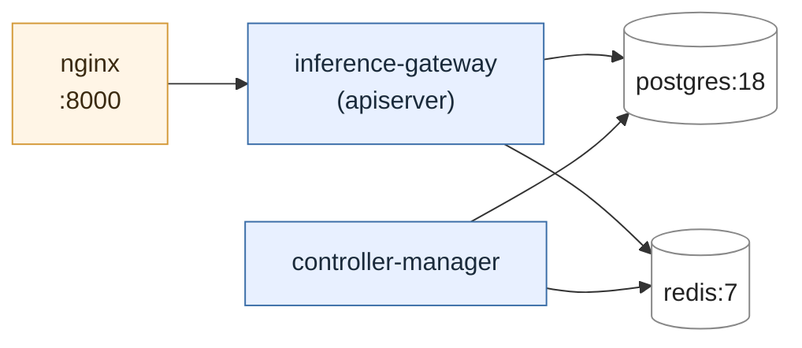

# Docker Deployment

The gateway stack runs as a small Docker Compose application: the
**apiserver**, the **controller-manager**, an NGINX reverse proxy in
front of the apiserver, plus Postgres and Redis.

The Compose definitions live under `deploy/`:

| File | Role |
|---|---|
| `deploy/compose.yaml` | Base service definitions (apiserver, controller-manager, nginx, postgres, redis). |
| `deploy/compose.dev.yaml` | Dev overlay — `tmpfs`-backed Postgres for fast, isolated test runs. |
| `deploy/compose.prod.yaml` | Prod overlay — persistent Postgres volume. |
| `deploy/Dockerfile` | Image used by both apiserver and controller-manager (same image, different command). |
| `deploy/nginx.conf` | Reverse proxy config; publishes the apiserver on `:8000`. |

## Quick start

The Makefile wraps the common Compose invocations. Configure
`COMPOSE_FILE` in your `.env` once and the targets do the rest — see the
[Developer Guide](../getting-started/developer.md) for the full env-file
layering.

```bash
# Bring up the full stack (dev overlay):
make compose-up

# Apiserver-only logs:
make watch-logs

# Tear down:
make compose-down

# Production overlay (persistent postgres volume):
make prod-up
make prod-down
```

Once up, the apiserver is reachable at <http://localhost:8000>; Postgres
and Redis are bound to their default ports for local testing.

## Services



Both `inference-gateway` and `controller-manager` are built from the same
`deploy/Dockerfile`; the controller-manager overrides `command` to run
`python -m first_gateway.controllers.manager`.

## Environment files

`env_file` layering (see `deploy/compose.yaml`):

1. `.env.default` — common defaults, checked in.
2. `.env.compose` — service-network specifics (e.g. `redis` / `postgres`
   hostnames inside the Compose network).
3. `.env.secret` — local-only secrets (Globus app credentials, CA
   material). `.gitignore`d.
4. `.env.prod` — optional production overrides.

`.env.local` is **not** loaded inside Compose; it exists only so that
running tests on the host machine can reach the published `localhost`
ports of the containerised Postgres/Redis.

All gateway settings use the `FIRST_` prefix with `__` for nested
fields — e.g. `FIRST_DB_URL`, `FIRST_GLOBUS__APP_ID`. See
[`settings.py`](https://github.com/argonne-lcf/inference-gateway/blob/main/packages/gateway/first_gateway/settings.py)
for the full `Settings` model.

## Troubleshooting

```bash
# Process status:
docker compose ps

# Recent logs from one service:
docker compose logs inference-gateway --since=1m
docker compose logs controller-manager --since=1m

# Reset dev DB (tmpfs — wipe is automatic, but force a rebuild too):
docker compose down -v
docker compose up -d --build
```

## Production notes

Container-native deployment is a primary goal of v2 (see
[Motivation](../architecture/motivation.md)) and the eventual target is
the ALCF Hermes Kubernetes cluster. The Compose prod overlay is a
single-host staging step; the same image, settings, and `Settings`
loading work in either environment.
