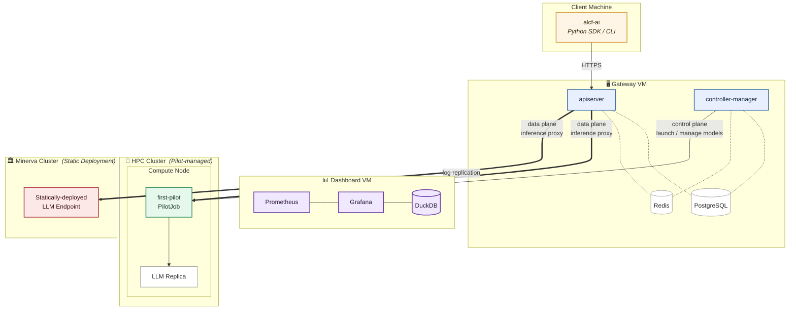

# FIRST Inference Gateway

FIRST (Federated Inference Resource Scheduling Toolkit) is ALCF's
self-hosted Inference-as-a-Service platform. It gives researchers cloud-like
access to AI models — a growing catalog of open-weight LLMs, and more
generally any model exposable over HTTP — running on ALCF's own HPC and
inference infrastructure. Sensitive data and custom models stay on-premises;
clients get the low-latency, OpenAI/Anthropic-compatible APIs that modern
interactive and agentic workloads expect.

The **Inference Gateway** sits in front of inference engines spread across
multiple, heterogeneous ALCF clusters and owns authentication,
authorization, request routing, federated load balancing, and model
lifecycle management.

## What it provides

- **Standard APIs.** [OpenAI](https://platform.openai.com/docs/overview)-
  and Anthropic-compatible endpoints with streaming, so existing client
  code and agent frameworks work unmodified regardless of the backend
  model.
- **Federated, multi-cluster serving.** A single logical model can be
  backed by deployments on several clusters at once; the gateway routes
  and load-balances across them, spanning heterogeneous accelerators
  behind one uniform API.
- **Always-on and on-demand models.** A set of "hot" models for immediate,
  low-latency inference, plus a large catalog of on-demand models that are
  cold-started transparently on first request.
- **Batch inference.** A batch submission API for queuing and running
  high-throughput workloads.
- **Arbitrary AI models.** Beyond LLMs, any model that can be served
  behind an HTTP interface can be registered and deployed — e.g., SAM3
  for promptable image segmentation.
- **Authentication and access control.** [Globus Auth](https://www.globus.org/globus-auth-service)
  integration with group-based authorization governing model access.

## How models are deployed

The gateway decouples *where* a model runs from *how* clients reach it, and
manages placement across pluggable deployment backends:

- **Static deployments** — a proxy to any externally managed API URL the
  service does not itself operate. The natural fit for vendor-managed or
  testbed systems (e.g., SambaNova) that already expose their own HTTP
  endpoint.
- **Pilot-job deployments** — models dynamically hosted and auto-scaled on
  HPC resources via traditional schedulers (e.g., PBS Pro), using
  [Globus Compute](https://www.globus.org/compute) on the control plane
  for scheduler RPCs.
- **Future backends** — the deployment interface is extensible (e.g.,
  NVIDIA Dynamo).

A central design goal is **declarative, gateway-side configuration**:
admins define, deploy, and load-balance models across clusters from the
gateway, without SSHing into individual cluster login nodes to edit files
and restart endpoints. See [Motivation](architecture/motivation.md) for
how we got here from v1.

## System Architecture



## Components

The Inference Gateway is a [uv workspace](https://docs.astral.sh/uv/concepts/projects/workspaces/)
under `packages/`:

| Package | Installed on | Purpose |
|---|---|---|
| [`first_common`](packages/gateway.md) | everywhere | Shared schema and error types |
| [`first_gateway`](packages/gateway.md) | user-facing server | API server + controller manager |
| [`first_pilot`](packages/pilot.md) | HPC compute nodes | Pilot job agent (one per allocation) |
| [`alcf_ai`](packages/client.md) | end users | Python SDK and CLI |
| `first_dashboard` | analytics server | Log aggregation, queries, dashboards |

## Where to next

- **[Developer Guide](getting-started/developer.md)** — local setup, env files, running tests.
- **Architecture**
    - [Motivation](architecture/motivation.md) — why v2 looks the way it does; goals and non-goals.
    - [Project Layout](architecture/project-layout.md) — the UV workspace and how packages split.
    - [Control / Data Plane](architecture/control-data-plane.md) — what runs where, and what stays up when things break.
    - [Request Routing](architecture/request-routing.md) — the per-request path through views and routers.
    - [Pilot Job System](architecture/pilot-system.md) — submission, mTLS terminator, replica lifecycle.
    - [Declarative Configuration](architecture/declarative-config.md) — Spec/Status pattern and apply mechanics.
    - [Data Model](architecture/data-model.md) — Postgres schema and the ER diagram.
    - [Controller Framework](architecture/controllers.md) — reconcile loops, leases, OCC.
- **[Docker Deployment](deployment/docker.md)** — deploying the gateway stack.
- **[Client SDK](packages/client.md)** — using the `alcf-ai` CLI and `InferenceClient`.
- **[Roadmap](roadmap.md)** — what's done, what's left for MVP, and the path to production.

## Citation

If you use ALCF Inference Endpoints or the Federated Inference Resource
Scheduling Toolkit (FIRST) in your research or workflows, please cite our
paper:

```bibtex
@inproceedings{10.1145/3731599.3767346,
  author = {Tanikanti, Aditya and C\^{o}t\'{e}, Benoit and Guo, Yanfei and Chen, Le and Saint, Nickolaus and Chard, Ryan and Raffenetti, Ken and Thakur, Rajeev and Uram, Thomas and Foster, Ian and Papka, Michael E. and Vishwanath, Venkatram},
  title = {FIRST: Federated Inference Resource Scheduling Toolkit for Scientific AI Model Access},
  year = {2025},
  isbn = {9798400718717},
  publisher = {Association for Computing Machinery},
  address = {New York, NY, USA},
  url = {https://doi.org/10.1145/3731599.3767346},
  doi = {10.1145/3731599.3767346},
  booktitle = {Proceedings of the SC '25 Workshops of the International Conference for High Performance Computing, Networking, Storage and Analysis},
  pages = {52–60},
  numpages = {9},
  series = {SC Workshops '25}
}
```

## Acknowledgements

This work was supported by the U.S. Department of Energy, Office of Science,
Office of Advanced Scientific Computing Research, under Contract No.
DE-AC02-06CH11357. This research used resources of the Argonne Leadership
Computing Facility, which is a DOE Office of Science User Facility.

## License

This project is licensed under the Apache License 2.0.
