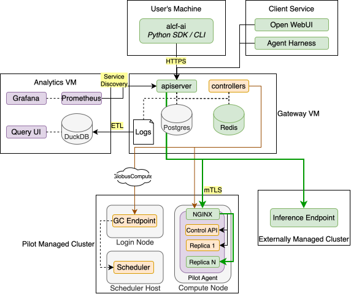

# FIRST Inference Gateway

FIRST (Federated Inference Resource Scheduling Toolkit) is ALCF's
self-hosted Inference-as-a-Service platform. It gives researchers cloud-like
access to AI models — a growing catalog of open-weight LLMs, and more
generally any model exposable over HTTP — running on ALCF's own HPC and
inference infrastructure. Sensitive data and custom models stay on-premises;
clients get the low-latency, OpenAI/Anthropic-compatible APIs that modern
interactive and agentic workloads expect.

The **Inference Gateway** sits in front of inference engines spread across
multiple, heterogeneous ALCF clusters and owns authentication,
authorization, request routing, federated load balancing, and model
lifecycle management.

## What it provides

- **Standard APIs.** [OpenAI](https://developers.openai.com/api/reference/overview)-
  and [Anthropic](https://platform.claude.com/docs/en/api/messages)-compatible endpoints with streaming, so existing client
  code and agent frameworks work unmodified regardless of the backend
  model.
- **Federated, multi-cluster serving.** A single logical model can be
  backed by deployments on several clusters at once; the gateway routes
  and load-balances across them, spanning heterogeneous accelerators
  behind one uniform API.
- **Rapid A/B Test and Experimental Deployments.** The routing system also facilitates rapid experimentation through parallel rollouts of model variants.
Inference engine settings are easy to change and roll back with declarative configuration.
- **Always-on and on-demand models.** A set of "hot" models for immediate,
  low-latency inference, plus a large catalog of on-demand models that are
  cold-started transparently on first request.
- **Arbitrary AI models.** Beyond LLMs, any model that can be served
  behind an HTTP interface can be registered and deployed — e.g., SAM3
  for promptable image segmentation.
- **Authentication and access control.** [Globus Auth](https://www.globus.org/globus-auth-service)
  integration with group-based authorization governing model access.

## Terminology

- **Endpoint:** Task-specific HTTP method+path exposed by the gateway API.
 `POST /api/federated/v1/chat/completions` is the API endpoint to create an OpenAI chat completion.
  Endpoints describe the task, _not_ the AI model.
- **Model:**  The Model resource provides the canonical _name_ of the AI model that users select when calling an API Endpoint.  Users invoke the endpoint `POST /api/federated/v1/chat/completions` while selecting the model in the request body: `{"model": "openai/gpt-oss-120b"}`. Models advertise their supported endpoints; LLMs generally support the standard OpenAI and Anthropic endpoints. Models like SAM3 support promptable image segmentation tasks.  Models also encapsulate usage policy: what user groups can access the model?  What are the per-user quotas for the model?
- **Deployment:** A model can have one or more Deployments, which describe how a live model backend is created.  Deployments are tied to _Clusters_, which group deployments sharing a common underlying platform (e.g. same HPC scheduler)
- **Backend:** One routeable instance of a model deployment, possessing a live URL that the gateway can proxy endpoint traffic to.

FIRST currently implements two concrete **Deployment** classes:

1. `StaticDeployment`: consists simply of a static base URL for exactly **one Backend**.  The gateway control plane does nothing to start, stop, or autoscale a StaticDeployment: the responsibility of launching and maintaining a healthy backend is out of scope. StaticDeployment can be used to provide model capacity via cloud APIs or other manually-managed backends.  For example, ALCF staff manually configure SambaStack on Metis and provide a static URL/API key for the Inference Gateway.
2. `PilotDeployment`: a recipe for **launching model backends** onto dynamically-allocated HPC resources. Here, the control plane owns the lifecycle of each backend and performs autoscaling: changing the number of desired backend `PilotReplicas` in response to model demand.  The system is self-healing: unhealthy replicas are replaced, and enables highly dynamic model placement on HPC resources (replicas can be placed/removed from GPU resources without disrupting neighboring replicas of other models on the same node)

Additional deployment types can be implemented, for example to integrate with additional control planes like NVIDIA Dynamo or Run:ai.  The contract between deployments and the data plane is that each deployment is responsible for advertising its healthy backends to the router.

- **Gateway:** API service, control plane orchestrator, and observability hub.  The user-facing API handles policy enforcement (authentication, model access group-based authorization, usage quota enforcement, capacity limits), dynamic load balancing to model backends, and efficiently proxying all AI endpoint traffic.
- **Control Plane Orchestrator:**  Provides a declarative (YAML manifest) configuration system for admins to define the desired Models and Deployments.  A Controller Manager framework runs the control loops that reconcile the desired Deployment state with the actual state of the system.  Static deployments are merely health-checked; the majority of the current responsibility for the control plane is to manage and automate `PilotDeployments`.
- **Observability Hub:**  A unified view of system health/activity: a web UI and CLI provide views into the current state of the control plane, including PilotDeployment details that previously required SSHing into clusters and searching a multitude of files (available resources, replica status and logs).  A Prometheus instance gathers metrics from the Controller Manager, the API servers, and all Model Backends that provide a Prometheus metrics endpoint.  This enables a "single pane of glass" Grafana view across the entire fleet of models running on heterogenous resources.
- **Control Plane:** The actors and APIs involved in managing model backends.  This spans everything from the declarative admin APIs to the Pilot system: HPC scheduler interfaces, pilot jobs, APIs to start/stop/health check models, and the mechanisms to advertise healthy backends to the data plane.
- **Data Plane:** The actors and APIs involved in the flow of inference endpoint traffic.  This is the clients, the user-facing gateway APIs, the policy/router/proxy engine, and the streaming HTTP connections to upstream model backends. The contract between the control plane and data plane is the published backend routing configuration, written into Redis.

The control plane is strongly decoupled from the data plane: it can crash and restart without impacting the flow of inference traffic for short periods of time.  The data plane makes intensive use of Redis as the centralized source of routing/policy truth shared among distributed API servers.  Persistent data (e.g. PostgreSQL transactions) are avoided in the data plane path.

## How models are deployed

The gateway decouples *where* a model runs from *how* clients reach it, and
manages placement across pluggable deployment backends:

- **Static deployments** — a proxy to any externally managed API URL the
  service does not itself operate. The natural fit for vendor-managed or
  testbed systems (e.g., SambaNova) that already expose their own HTTP
  endpoint.
- **Pilot-job deployments** — models dynamically hosted and auto-scaled on
  HPC resources via traditional schedulers (e.g., PBS Pro).

A central design goal is **declarative, gateway-side configuration**:
admins define, deploy, and load-balance models across clusters from the
gateway, without SSHing into individual cluster login nodes to edit files
and restart endpoints. See [Motivation](architecture/motivation.md) for
how we got here from v1.

## System Architecture

Participants in the path of an inference request are shown in green:



## Components

The Inference Gateway is a [uv workspace](https://docs.astral.sh/uv/concepts/projects/workspaces/)
under `packages/`:

| Package | Installed on | Purpose |
|---|---|---|
| `first_common` | everywhere | Shared schema (resource Specs, pilot wire types, scheduler ABC) and error hierarchy |
| [`first_gateway`](packages/gateway.md) | user-facing server | API server + controller manager |
| [`first_pilot`](packages/pilot.md) | HPC compute nodes | Pilot job agent (one per allocation) |
| [`alcf_ai`](packages/client.md) | end users | Python SDK and CLI |
| `first_dashboard` | analytics server | Log aggregation, queries, dashboards (skeleton only) |

## Where to next

- **[Developer Guide](getting-started/developer.md)** — local setup, env files, running tests.
- **Architecture**
    - [Motivation](architecture/motivation.md) — why v2 looks the way it does; goals and non-goals.
    - [Project Layout](architecture/project-layout.md) — the UV workspace and how packages split.
    - [Control / Data Plane](architecture/control-data-plane.md) — what runs where, and what stays up when things break.
    - [Request Routing](architecture/request-routing.md) — the per-request path through views and routers.
    - [Pilot Job System](architecture/pilot-system.md) — submission, mTLS terminator, replica lifecycle.
    - [Declarative Configuration](architecture/declarative-config.md) — Spec/Status pattern and apply mechanics.
    - [Data Model](architecture/data-model.md) — Postgres schema and the ER diagram.
    - [Controller Framework](architecture/controllers.md) — reconcile loops, leases, OCC.
- **[Docker Deployment](deployment/docker.md)** — deploying the gateway stack.
- **[Client SDK](packages/client.md)** — using the `alcf-ai` CLI and `InferenceClient`.
- **[Roadmap](roadmap.md)** — what's done, what's left for MVP, and the path to production.

## Citation

If you use ALCF Inference Endpoints or the Federated Inference Resource
Scheduling Toolkit (FIRST) in your research or workflows, please cite our
paper:

```bibtex
@inproceedings{10.1145/3731599.3767346,
  author = {Tanikanti, Aditya and C\^{o}t\'{e}, Benoit and Guo, Yanfei and Chen, Le and Saint, Nickolaus and Chard, Ryan and Raffenetti, Ken and Thakur, Rajeev and Uram, Thomas and Foster, Ian and Papka, Michael E. and Vishwanath, Venkatram},
  title = {FIRST: Federated Inference Resource Scheduling Toolkit for Scientific AI Model Access},
  year = {2025},
  isbn = {9798400718717},
  publisher = {Association for Computing Machinery},
  address = {New York, NY, USA},
  url = {https://doi.org/10.1145/3731599.3767346},
  doi = {10.1145/3731599.3767346},
  booktitle = {Proceedings of the SC '25 Workshops of the International Conference for High Performance Computing, Networking, Storage and Analysis},
  pages = {52–60},
  numpages = {9},
  series = {SC Workshops '25}
}
```

## Acknowledgements

This work was supported by the U.S. Department of Energy, Office of Science,
Office of Advanced Scientific Computing Research, under Contract No.
DE-AC02-06CH11357. This research used resources of the Argonne Leadership
Computing Facility, which is a DOE Office of Science User Facility.

## License

This project is licensed under the Apache License 2.0.
