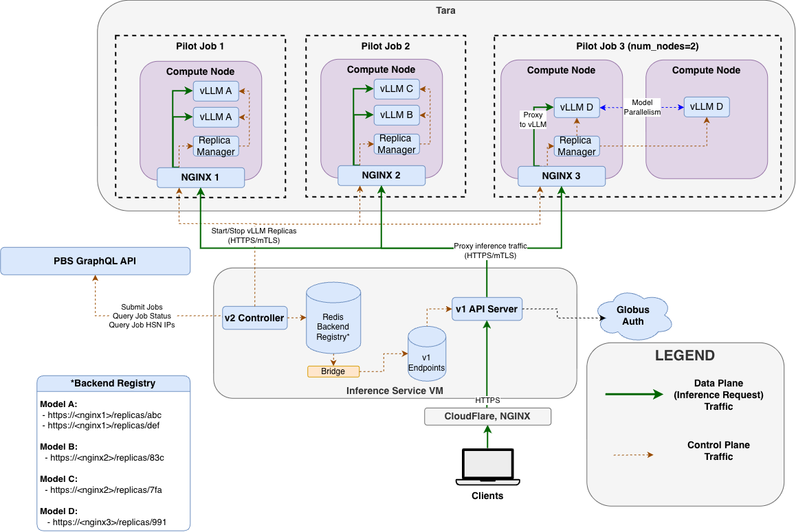
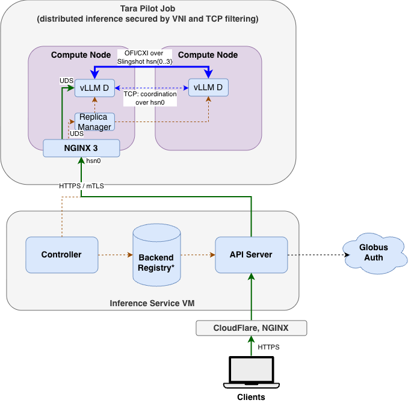

# Tara Inference Service Integration

This document describes the security architecture for integrating the **Tara**
cluster as a backend for the ALCF Inference Service.
The design reuses several mechanisms already vetted and in production for
the Inference Service and the IRI API project.



## 1. Overview

Like Minerva, Tara is a dedicated inference-service cluster. Unlike Minerva,  where the
gateway proxies to a *statically configured* login-node NGINX and does not
participate in model startup - Tara is driven by the Inference Service's **V2
control plane**, which launches and scales model replicas inside PBS **pilot
jobs** and publishes the resulting backends into the existing, internet-facing
**V1 API server** through a one-way **bridge**.


Two independent planes make up the integration, with very different
availability and exposure profiles:

| Plane | Path | Exposure | Auth |
| ----- | ---- | -------- | ---- |
| **Data plane** (inference) | Client → CloudFlare → CELS NGINX → V1 API server → Tara pilot NGINX → vLLM | Public internet (via the vetted V1 API server) | Globus Auth + per-endpoint Globus-group gating; mTLS to backend |
| **Control plane** (model lifecycle) | V2 controller → PBS GraphQL API (job launch) and → pilot NGINX `/control/` (replica start/stop) | **Internal only** - Inference Service CELS VMs, firewalled | Keycloak (Tara realm) token for job launch; mTLS for replica control |

As always, external users can only interact with the existing V1 API server,
which enforces uniform Globus authentication and authorization for
every model backend.  The compute nodes of Tara shall only be reachable from the Inference Service VMs over mutually authenticated TLS.

Backend access is enforced with **two independent layers** at the pilot NGINX:

1. **Mutually authenticated TLS.** The client must present a valid certificate,
   so the backend authenticates the gateway and the gateway authenticates the
   backend. Neither side will complete a connection to an unauthenticated peer.
2. **IP allow-listing.** NGINX applies a default `deny all` policy with
   exceptions only for the Inference Service Gateway VM IP address(es), so even
   a client holding a valid certificate is rejected unless it originates from an
   approved source.

Both layers must pass before a request reaches any backend service; either one
failing rejects the connection at the NGINX layer. These layers are described in
detail in Sections 5 and 6.

The control plane that launches jobs is fully decoupled from the data plane services and never exposed outside of the Inference VM host.


Today, Tara access is gated to an internal developer Globus group and reachable
only from the firewalled Inference Service Dev VM.

The purpose of this review is to enable
Tara for general inference through the **existing, production V1 API server**.

The V2 Pilot Deployment system replaces static configuration (where
`https://minerva-login-01.alcf.anl.gov:9443` is manually written into v1
PostgreSQL) with dynamic model placement and service discovery (admins configure
desired models; control plane launches replicas, monitors health, recovers from
outages, and registers healthy IPs dynamically with the gateway).  Tara is
positioned as the first adopter of this control plane because it removes any
single cluster node as a point of failure and is resilient to dynamic IP churn
even in the absence of DNS.

## 2. Data plane

The front of the data plane is **unchanged from production**: external traffic
arrives through the CloudFlare CDN to a CELS-managed NGINX, which forwards to
the gateway VM's NGINX. That NGINX terminates SSL and reverse-proxies to
gunicorn on `localhost:7000` running the V1 Inference API server. User
authentication and authorization (Globus Auth, per-endpoint
`allowed_globus_groups`) is handled identically for Tara as for every other
backend - the model backend is transparent to the auth layer.

For a Tara model, the V1 API server proxies the inference request to a Tara
pilot's NGINX over **HTTPS with mutual TLS**, using the `FirstV2Endpoint`
adapter. The gateway reads the target backend URLs from its `Endpoint` row and
presents its **client certificate** on every backend connection to a Tara
Compute node.

This transport mirrors the Minerva integration, which
also uses mTLS from the gateway into NGINX.
Inside each Tara allocation, the pilot NGINX is the **only** externally
reachable listener; it terminates mTLS and reverse-proxies to vLLM replicas
that are bound to **Unix domain sockets in temporary folders with 700 filesystem permissions**. This single listener is guarded by both layers noted in Section 1 — mutually authenticated TLS **and** an NGINX `deny all` policy that admits only the Gateway VM IP(s). There is no TCP port on
which the vLLM API server is directly reachable, not even from `localhost`.
This ensures that traffic _must_ be authenticated through the service account's NGINX and requests can therefore only be initiated from the trusted CELS gateway.

For this reason, unlike Minerva, HTTPS is not used in the Tara NGINX-to-vLLM connection. There is never a TCP socket involved in this connection; intercepting traffic would require access to the service user account's private files on the vLLM host itself.

## 3. Remote job submission: PBS GraphQL + Keycloak

Model replicas run inside PBS **pilot jobs**. The V2 controller submits,
queries, and terminates those jobs on Tara through a **PBS GraphQL API**
endpoint. This is the most security-relevant new surface, so it is described in
detail.

**Network isolation.** The PBS GraphQL endpoint sits behind the same internal
bridge server that already gates all the other GraphQL endpoints used in
production for the IRI API project (Polaris and Crux). Unlike IRI, remote job submission on Tara is **not** exposed through any user-facing API. Access to this
GraphQL API is restricted to the ALCF network.

**Token authentication.** The PBS GraphQL server requires an access token in
the request headers to authorize job submission and to determine which ALCF
user will own the job. As with the IRI API, all tokens sent to GraphQL are
minted by the ALCF Keycloak server. A **dedicated Tara Keycloak realm** has
been created specifically for this endpoint: only Keycloak tokens minted for
Tara are accepted. Tokens generated to submit jobs on other production systems
are rejected by Tara, and Tara tokens are rejected elsewhere. This confines the
blast radius of any single token to a single system.

**Service-account impersonation.** To run jobs as the `openinference_svc`
service account, the controller uses a **confidential Keycloak impersonation
client**, the same pattern already in production for the IRI API. The client
performs a two-step OAuth flow — client-credentials to obtain the service
account token, then RFC 8693 token exchange to obtain a token for the requested
subject — implemented in `keycloak_client.py` (`KeycloakServiceTokenAuth`),
with proactive refresh and single-retry re-authentication on a 401.

On Tara, the impersonation client is **configured to allow impersonation of
`openinference_svc` only**. No other ALCF user can be impersonated through this
client. This is a tighter policy than a general impersonation client and is the
intended steady state for the integration.

**Job submission mechanics.** The GraphQL adapter (`graphql_pbs.py`) submits a
job by base64-encoding the inline pilot launch script (URL-safe base64,
preserving the script verbatim) and issuing a `createJob` mutation with the
requested walltime, node/task counts, GPUs per node, queue, accounting id, and
log paths. It reads job state and, for actively placed jobs, the head node's
high-speed-network (HSN) IP via `get_job_statuses`, and terminates jobs via
`deleteJob`. Only these three operations (submit, status, terminate) are used.

When a job begins running, the HSN IPs are surfaced in the job status query
and associated to the pilot job.  mTLS HTTPS Requests are made directly to the IP of `hsn0` on the pilot job head node. As everywhere the backend is reachable, that listener enforces both layers from Section 1: mutually authenticated TLS and an NGINX `deny all` policy admitting only the Gateway VM IP(s).

Overall, the job submission flow reuses the infrastructure and authentication
mechanisms in place for IRI, but with a substantially reduced exposure:

- unlike IRI, which can impersonate any ALCF user, the Inference Service client will only
submit jobs as `openinference_svc`
- unlike IRI, which provides an internet-facing API for users to submit arbitrary scripts, the
Inference Service control plane has no inbound connectivity and submits only the trusted, service-user-controlled `first-pilot`
application to the PBS GraphQL API.

The GraphQL integration also provides significant advantages over the Globus Compute integration with Sophia, since it
keeps all traffic internal to ALCF (no hop through AWS) and does not require the deployment of a Globus Compute Endpoint manager
process and Parsl HTEX Interchange process _per-model_ on a login node. This results in improved reliability and availablilty:
as long as the PBS endpoint is reachable, the system does not rely on any single Tara service node to remain available.

### 3.1 Pilot Job Configuration

All software, configuration, and weights used by the Tara inference backend are
stored under `/vast/draco/tara/projects/Tara_Deploment/inference_service/`,
which has access restricted to the owner service user `openinference_svc` and
group `inference_service` (`770` permissions).

The pilot job submitted to PBS runs the `first-pilot` Python entrypoint,
which reads its configured CA certificate, server certificate/key, and path to userspace NGINX binary from a configuration file with `600` permissions.  The service starts the Pilot Job's control FastAPI server, bound to a local unix domain socket in a temporary directory with `700` permissions.  This process then starts and manages the lifecycle of the NGINX server, placing itself behind the `/control/` API path and refreshing the proxy configuration as model replicas are started and stopped on the allocation.


## 4. The V2 → V1 bridge

In the upcoming V2 Inference Gateway, the control plane writes healthy model backend metadata into a Redis registry, and the API servers continually update an in-memory snapshot of that registry to forward requests to live models.  While the V2 gateway is in development, we will deploy a temporary,
lightweight, standalone **bridge** (`manage.py first_v2_bridge`): a sidecar service that lets the
V2-managed Tara backends appear in the production V1 API server without coupling
the two systems' state.  This is a thin, temporary adapter between the V2 control plane and V1 API server while the V2 API server is in development.

The bridge **polls V2's Redis** for its `router-cfg` blob and reconciles V1
`Endpoint` rows in PostgreSQL to match the set of healthy pilot backends.
It manages one row in the `Endpoint` table per Tara model
containing the healthy backend URLs.

Because the bridge is one-directional (V2 Redis → V1 Postgres) and only ever
publishes **healthy** backends, a failed or drained model simply stops being
advertised: the corresponding V1 `Endpoint` row is deleted on the next
reconcile and the V1 server stops routing to it. A control-plane or bridge outage does not interrupt in-flight inference — the last-reconciled rows keep serving until
the bridge next runs.

## 5. Transport security: mTLS and PKI

All communication between the Inference Service VMs and Tara — both the
inference data plane and the replica-control plane — is protected by **mutual
TLS**. This ensures that only the Inference Service gateway can talk to a Tara
pilot, and that the gateway is talking to a genuine pilot.

- **Certificate authority.** A self-signed root CA signs all leaf certs
  (`certmanager`). As with Minerva, we intend to pursue a **risk acceptance**
  for the self-signed CA and continue development toward certificates issued
  through proper ALCF channels. mTLS on top of TLS provides a strong
  authentication layer regardless of CA provenance.
- **Server certs.** Server certificate and keys are stored securely on
  on Tara (`/vast/draco/tara/projects/Tara_Deployment/inference_service/first-pilot`) belonging to the `openinference_svc` service account with 600 permissions.  The server certificate is isused with a 365 day expiration.
  Dynamic per-job cert issuance can be revisited for Tara in the future, as it
  will require a filesystem integration that is not currently enabled with the GraphQL PBS interface.
- **Algorithm.** Certificates use **ECDSA** (elliptic-curve) P-256 keys.
- **TLS version.** The pilot NGINX is configured for **TLSv1.3 only**
  (`ssl_protocols TLSv1.3;`); TLSv1.2 and below are not offered.
- **Client verification.** The pilot NGINX enforces mandatory client-cert
  verification (`ssl_verify_client on; ssl_verify_depth 1;`) against the shared
  CA, so an unauthenticated or wrongly-signed client is rejected at the TLS
  layer before any request is processed.

The gateway's `client.key` lives on the Inference Service VM and is stored under
the `webportal` service user account with `600` permissions.

## 6. On-node architecture and vLLM security posture

Inside each PBS allocation, the `first-pilot` agent brings up a single NGINX
terminator and supervises one or more vLLM **replicas**:

- **Single entrypoint per node.** The pilot opens **one** external port per
  compute node (mTLS-protected, above). Every reverse-proxied service binds to a local **Unix domain socket** in a temporary directory with `700` permissions.  This
  ensures that even other users located on the same node cannot bypass mTLS.
  NGINX reverse-proxies `/control/` to the FastAPI control endpoints and `/replicas/{name}/` to the local vLLM instances.
- **IP allow-listing at NGINX.** In addition to mTLS, each proxied location is
  wrapped in an `allow <gateway-ip>; … deny all;` block, so only the Inference
  Service VMs (and loopback) can reach the control and replica routes even if
  they possessed a client cert.
- **Service account.** Pilots, NGINX, and vLLM all run as the
  `openinference_svc` service account, isolating production services from user
  accounts (as on Sophia/Minerva).  All software and weights are stored under a
  directory accessible only to the owning service account and `inference_service` group.
- **Replica supervision.** The replica manager runs each vLLM as its own
  process group with a health-monitor thread; replicas that fail to start or go
  unhealthy are torn down locally and garbage-collected/replaced by the
  controller.

The following posture items mirror the vLLM security questions raised in the
Minerva review and are answered here pre-emptively:

- **Protected endpoints only:**  The Minerva deployment of NGINX on `minerva-login-01` necessitates a network connection to the vLLM server backends, which is secured with TLS and HTTP Authorization header-based access control (`vllm serve --api-key`). In contrast, the v2 Pilot system deployed on Tara enforces that vLLM replicas bind to a private local unix domain socket owned by the service user. This prevents access to the vLLM API from other network hosts or other user accounts on the same host. Therefore, vLLM on Tara is not configured with HTTP Authorization header-based access control, as this would be redundant with the `700` filesystem permissions protecting the UDS file itself.
- **No tool / MCP servers:** No tool or MCP servers are enabled. Tara is dedicated to serving models. Any future change will be evaluated with CELS Cybersecurity first.
- **No gRPC:**  The gRPC interface is not used.
- **Cache-directory security:**  The vLLM cache and model directories are owned by `openinference_svc` and protected by the `inference_service` Linux group with `770` permissions.
- **Dedicated nodes:**  The Tara nodes used by the service are dedicated to inference.
- **Distributed (multi-node) inference:** **In scope and required** — individual Tara nodes are too weak to host the larger models, so multi-node/model-parallel replicas (e.g. Pilot Job 3 in the diagram) are essential to the utility of the service. Tara is a locked-down, dedicated cluster: only trusted service admins can access it, the sole network entrypoint is the mTLS-protected, firewalled pilot NGINX, and inter-node traffic stays within a single PBS allocation on the cluster's high-speed network. This is the **same risk that was formally documented and accepted for Minerva**, and we request the same path here.

## 7. Distributed Inference

Section 6 covers the on-node posture for a single compute node. Larger models,
however, exceed the memory of any single Tara node and must be sharded across
several nodes within one PBS allocation. This section describes how those
multi-node replicas are launched and, more importantly, how the inter-node
traffic they generate is isolated.




Within one PBS allocation, PALS starts a vLLM node worker on each compute node.
The head node's `NGINX 3` terminates mTLS and reverse-proxies to the local vLLM
API over a Unix domain socket (Section 6). Other nodes are headless, but still
have distributed/RPC TCP listeners. Inter-node model traffic uses the HSN:
native GPU collectives are protected by Slingshot VNI isolation, while
coordination TCP is protected by per-job firewall rules.

### 7.1 Launch mechanics

Cross-node process launch on Tara uses **Cray PALS/MPI**, but vLLM itself runs
with its **multiprocessing (`mp`) executor, not Ray**. The division of
responsibility is deliberate:

- **PALS/MPI** provides process startup and rank assignment. `mpiexec`
  launches one node-worker entrypoint on each allocated compute node.
  **MPI is not the model tensor-transport layer.**
- **vLLM (`--distributed-executor-backend mp`)** owns distributed inference
  and starts the engine/GPU worker processes.
- **NCCL** carries inter-node GPU collectives using the **AWS OFI NCCL plugin**
  over Slingshot / libfabric CXI (`NCCL_NET=OFI`, `FI_PROVIDER=cxi`).
  Inkling also uses its native intra-node Lamport collective path.

The current Inkling vLLM 0.29 recipe runs across **8 nodes × 4 GPUs/node**,
configured as:

- **Tensor parallel: 4** (the 4 GPUs within each node)
- **Data parallel: 8** (across the 8 nodes)
- **Pipeline parallel: 1**
- **Expert parallelism enabled**
- Rank 0 hosts the Unix-domain-socket API and is fronted by NGINX; all other
  node ranks run **headless**.

A simplified view of the launch:

```bash
# PALS launches one worker entrypoint on each allocated node
mpiexec ... model-node-worker.sh

# Each PALS rank then runs approximately:
FI_PROVIDER=cxi \
NCCL_NET=OFI \
NCCL_NET_PLUGIN=ofi \
OFI_NCCL_PROTOCOL=SENDRECV \
vllm serve "$WEIGHTS" \
  --served-model-name inkling-bf16 \
  --distributed-executor-backend mp \
  --nnodes 8 \
  --node-rank "$PALS_RANKID" \
  --master-addr "$MASTER_ADDR" \
  --master-port "$MASTER_PORT" \
  --tensor-parallel-size 4 \
  --pipeline-parallel-size 1 \
  --data-parallel-size 8 \
  --data-parallel-size-local 1 \
  --data-parallel-address "$MASTER_ADDR" \
  --data-parallel-rpc-port "$DATA_PORT" \
  --enable-expert-parallel
```

Rank 0 additionally receives `--uds "$UDS"` (so NGINX can reach it over the
Unix domain socket); every other node rank receives `--headless`. The actual
launch wrapper also activates the verified TCP port-confinement library
described in Section 7.3.

Model TCP consistently uses **`hsn0`**, not `hsn[1-3]` or `bond0`.
`MASTER_ADDR` is the head's `hsn0` address; `VLLM_HOST_IP` is the local
`hsn0` address. Gloo and NCCL TCP bootstrap select the same interface, and
the launcher verifies the HSN route to the master.
Nodes stay within one rack
(`x4818`, `x4819`, or `x4820`), not necessarily one chassis.

### 7.2 Secure operating boundary: Slingshot VNI isolation

The network isolation boundary is the **PBS job**. For native Slingshot/RDMA
traffic, PBS/PALS provisions the job's **Virtual Network Identifier (VNI)** and
CXI service. The NIC permits communication between authorized endpoints and
drops native packets with a non-matching VNI. This protects the NCCL/OFI
collectives; it does **not** establish isolation for ordinary TCP/IP over HSN.

Native OFI/CXI traffic is not encrypted by this deployment. Its protection
relies on site-managed fabric isolation rather than transport encryption.
See HPE's [VNI overview documentation](https://support.hpe.com/hpesc/public/docDisplay?docId=dp00006842en_us&page=operations/vni_overview.html)
and [CXI services documentation](https://support.hpe.com/hpesc/public/docDisplay?docId=dp00008089en_us&page=operations/cxi_services.html)
for more details.
The separate coordination-TCP control is described below.

### 7.3 Inter-node traffic paths

vLLM uses native NCCL/OFI collectives and **TCP** rendezvous, bootstrap, and
distributed/RPC coordination. Both use HSN, but their access controls differ.

**Per-job iptables rules are installed in the PBS prologue** on every
allocated node before model startup. For the assigned coordination ports,
new connections are accepted only from the **HSN addresses of nodes in that
same PBS allocation**, not the whole HSN subnet. **All** other remote sources are
dropped. Rules preserve local/loopback communication and legitimate established
replies. The **PBS epilogue removes the job-specific permissions after workload
cleanup**, preventing stale peer access when nodes are reassigned.

The listener contract assigns one slot to an instance across all its nodes;
headless workers share that slot:

| Instance slot | Optional HTTP API | Rendezvous / DP startup | Other internal TCP listeners |
| --- | --- | --- | --- |
| 0 | 8000 | 20000–20001 | 50000–50255 |
| 1 | 8001 | 20002–20003 | 50256–50511 |
| 2 | 8002 | 20004–20005 | 50512–50767 |
| 3 | 8003 | 20006–20007 | 50768–51023 |

Thus the coordination ranges are **20000–20007 and 50000–51023**, with each
instance confined to its assigned subset. Normal FIRST serving uses UDS,
so 8000–8003 need no remote HTTP allowance but are retained as an optional
fallback path. NCCL RAS remains **loopback-only on 28028**.

A checksum-verified C library, injected only at the vLLM engine-launch boundary
after PALS startup, confines native TCP listeners to this contract. Activation
is checked in engine/worker processes; invalid activation, unsupported required
socket options, and range exhaustion fail rather than widening the pool.
This library controls port selection; it is **not a security sandbox** and does
not prevent deliberate bypass. **The per-job firewall is the TCP security
boundary.**

Some native listeners bind wildcard addresses. The rules therefore protect
these ports on all ingress interfaces and are ordered so earlier broad
ACCEPT rules do not bypass them.

The complete traffic picture for a multi-node replica:

| Traffic | Path | Protection |
| ------- | ---- | ---------- |
| Production/Dev VM → Model (ingress) | HTTPS/mTLS to the head-node NGINX | mTLS; control-API IP allow-listing (Sections 5, 6) |
| NGINX → vLLM API | Local Unix domain socket; no network TCP | Private service-owned runtime-directory/socket permissions (Section 6) |
| vLLM node-to-node coordination | TCP over `hsn0`, in the assigned port ranges | Per-job PBS prologue/epilogue firewall rules, restricted to allocated peer HSN addresses |
| NCCL inter-node collectives | OFI/CXI over Slingshot HSN (`hsn[0-3]`) | Job-scoped Slingshot VNI/CXI isolation |
| NCCL RAS | Loopback TCP 28028 | Loopback-only bind; no remote exception |

The internal TCP channels are not TLS-encrypted; they rely on the job-scoped
firewall, not VNI. These controls, an mTLS-protected single ingress path,
Slingshot VNIs, and per-job firewall rules, isolate the allocation from
outside-job traffic. The result is ethat every byte leaving a compute node
is protected through the above controlling measures.


## 8. Conduit requests

The following network conduits are required between the Inference Service VMs in
CELS and the Tara / bridge endpoints. All connections are outbound from the CELS
source VMs to the destinations below.

**Sources**

| IP | Host |
| -- | ---- |
| `140.221.33.155` | `inference-api-dev.cels.anl.gov` — the Dev VM in CELS |
| `140.221.33.25` | `data-portal-dev-vmw-01` — the Production VM in CELS |

**Destinations / Ports**

| Destination | Resolved IP / CIDR | Port |
| ----------- | ------------------ | ---- |
| `graphql-bridge-dev-01.lab.alcf.anl.gov` | `10.140.50.167` | 443 |
| All Tara compute nodes' `hsn*` interfaces (Tara South) | `10.124.128.0/21` (`10.124.128.0`, mask `255.255.248.0`) | 9443 |
| All Tara compute nodes' `hsn*` interfaces (Tara North) | `10.124.160.0/21` (`10.124.160.0`, mask `255.255.248.0`) | 9443 |

Port 443 to the GraphQL bridge carries the PBS job-submission control plane
(Section 3). Port 9443 to the Tara compute-node `hsn*` interfaces carries the
mTLS inference and replica-control traffic to the pilot NGINX (Sections 2, 6);
both security layers from Section 1 (mutually authenticated TLS and NGINX IP
allow-listing) apply to every connection on this port.

## Appendix: Tara vs Minerva

| Aspect | Minerva | Tara |
| ------ | ------- | ---- |
| Model control | Custom PBS launcher + registry on the login node; gateway not involved | V2 controller launches/scales replicas in PBS **pilot jobs** via GraphQL |
| Backend registration | Static gateway config (`models.json`). New model additions require `manage.py loaddata` on Gateway VM. | **Bridge** reconciles healthy backends from V2 Redis into V1 `Endpoint` rows |
| Job submission | Manual tools invoke PBS from Minerva login node under `openinference_svc` user | **PBS GraphQL API** + dedicated **Tara Keycloak realm**, impersonating `openinference_svc` |
| Entrypoint | Login-node NGINX (`:9443`), mTLS | Per-job pilot NGINX (one port per head compute node), mTLS |
| vLLM binding | HTTPS to `0.0.0.0:8000` + shared API key, firewalled | **HTTP over Unix domain sockets** in temporary directories with `700` permissions (no TCP port). |
| Data-plane transport | Direct HTTPS/mTLS from gateway | Direct HTTPS/mTLS from gateway |
| Multi-node inference | In scope, risk accepted | In scope, same risk-acceptance path requested |

## Appendix: Code References

- [Pilot Control API](https://github.com/argonne-lcf/FIRST/blob/firstv2/packages/pilot/first_pilot/control_api.py)
- [Pilot NGINX Manager](https://github.com/argonne-lcf/FIRST/blob/firstv2/packages/pilot/first_pilot/nginx_manager.py)
- [SSL Cert Manager](https://github.com/argonne-lcf/FIRST/blob/firstv2/packages/gateway/first_gateway/services/certmanager/__init__.py)
- [Tara Keycloak Client Auth Flow](https://github.com/argonne-lcf/FIRST/blob/firstv2/packages/gateway/first_gateway/services/keycloak_client.py)
- [GraphQL Scheduler Adapter](https://github.com/argonne-lcf/FIRST/blob/firstv2/packages/gateway/first_gateway/platforms/schedulers/graphql_pbs.py)
- [v2 -> v1 Bridge](https://github.com/argonne-lcf/FIRST/blob/main/resource_server_async/management/commands/first_v2_bridge.py)
- [Bridge deployment notes](https://github.com/argonne-lcf/FIRST/blob/main/deploy/first_v2_bridge.md)
